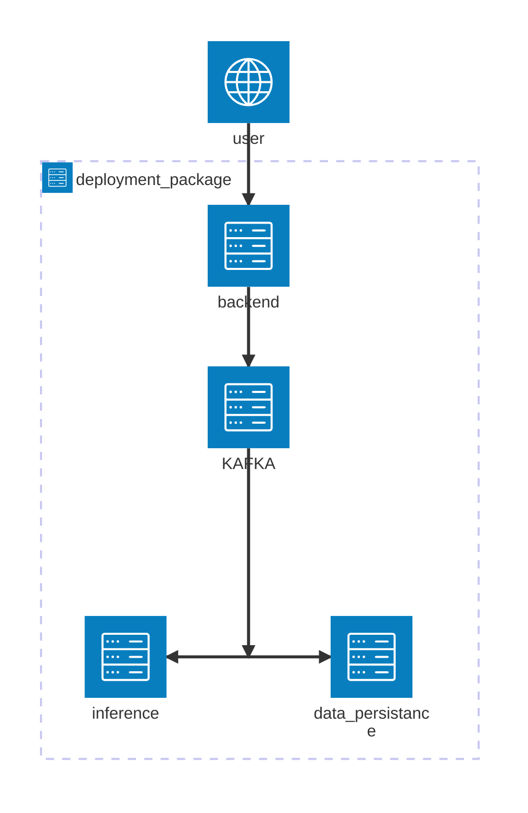
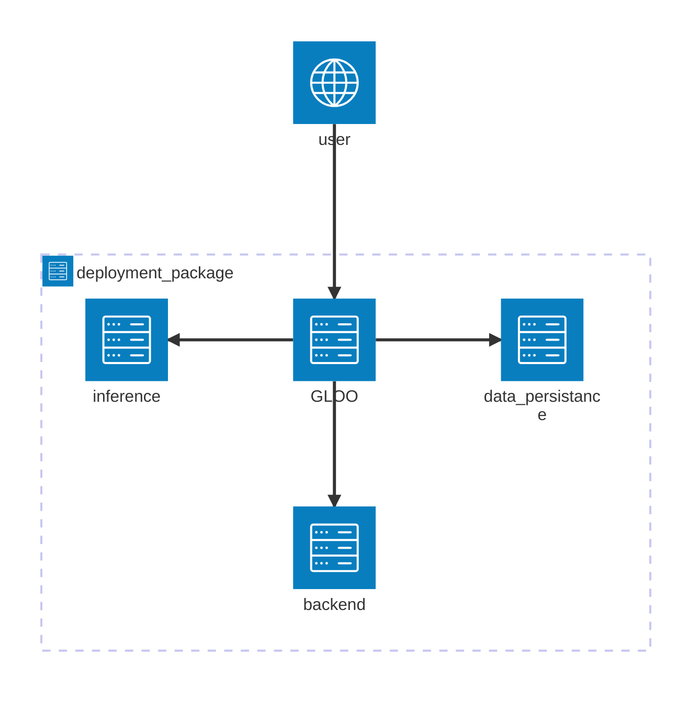

# ISIC Skin Cancer Classification

I submittd this project to DataTalks MLOps-zoomcamp 2025 course. [Course Link](https://github.com/DataTalksClub/mlops-zoomcamp)  

In this project, I created an MLOps system to classify skin cancer images from the Kaggle ISIC skin cancer dataset. [Dataset link](https://www.kaggle.com/competitions/isic-2024-challenge)

## Problem Description

**Skin cancer** can be deadly if not caught early. To prevent late diagnosis, machine learning models are developed to detect possible skin cancer with low cost.  

In this problem, data samples are composed of skin images and additional categorical and  numerical features. The goal is classify malignant skin lesions from benign ones.  

## Project Overview

In this project, we developed an MLOps system to automate the following tasks:  
- model training and validation
- experiment tracking
- workflows orchestration
- models deployment
- monitoring

## Technology Stack

### Machine Learning

| Component                  | Technology                    |
|----------------------------|-------------------------------|
| Programming Language       | Python 3.12                   |
| Machine Learning Framework | PyTorch + PyTorch-Lightning   |
| Inference Framework | TensorRT   |
| Data Preprocessing         | AlbumentationsX + Torchvision |

### MLOps

| Component                                  | Technology |
|--------------------------------------------|------------|
| Workflow Orchestration                     | Airflow    |
| Experiment Tracking and Model Registry     | MLFlow     |
| Containerization                           | Docker     |
| Deployment Packaging and Software Management | Helm       |
| Container Orchestration                    | Kubernetes |

-  All components have been deployed to a single-node **Kubernetes** cluster
- We used [**microk8s**](https://microk8s.io/) as a kubernetes orchestrator
- All software are managed (installation/upgrade/uninstallation) through [**Helm**](https://helm.sh/)

### Model Training

- The model training pipeline is handled through Airflow as a dag.

- The different stages:
  1. Allocate Kubernetes resources
  1. Download data
  2. Initialize MLFlow run
  3. Preprocess data
  4. Perform actual training
  5. Cleanup Kubernetes resources

- The  training and preprocessing code files are all logged to MLFlow for reproducibility. We also fixed initial randomness seeds to emphasize on the same goal.


### Model Deployment

-  The deployment package is managed using Helm. 

- We used a combination of streaming and webservice architectures.  

- The deployment package is composed of 3 components:
    1. **backend**: receives new data samples
    2. **data-persistance**: persists new data samples to database and file storage
    3. **inference**: performs  inference and saves probability scores to databasse

- To upload new data samples, we used the following **KAFKA-based** streaming architecture:   



- To query for uploaded data or inference  scores, we used a webservice architecture.  

To route http requests to the different components, we used [Gloo](https://www.solo.io/products/gloo-gateway) as an API gateway.



Depending on the request URL:  
  - localhost:port/v1/backend => backend component
  - localhost:port/v1/data-persistance => data persistance component
  - localhost:port/v1/inference => inference component

###  Monitoring

- Monitoring is performed as an  airflow dag. It can be scheduled to run on a daily basis. (To Do)

-  Monitoring can be done for a single date or a date range. (configuration through the Airflow UI)

- The Monitoring data is saved to a database. We used evidently to partially compute the metrics.

- A Grafana dashboard is used to display the results in a more intuitive way.

- True skin cancer cases with inference score < 0.5 are registered as alarms and displayed in the dashboard. (Missing true cancer cases is disastrous. It is more important to find all cancer cases than to flag a non-cancerous case)

### Code Quality

We used:
  - black for code formatting
  - isort for  import sorting
  - pylint for code linting
  - makefile to automate the different task
  - pre-commit hooks
  - one integration test
  - unit tests using pytest (only one test is added currently)

## Setup & Running

Prerequisites:
  - ubuntu 24.04 LTS (software tested only Ubuntu)
  - Python: 3.12
  - Git
  - Docker

### 1. Clone Repository

```shell
git clone https://github.com/Mahdi-Moalla/isic-skin-cancer-classification
```

### 2. Install microk8s

for Ubuntu-based systems, you can use make to install microk8s
```shell
make init-microk8s
```
For other systems, please refer  to this [link](https://microk8s.io/tutorials)

### 3. Install Kubectl

Kubectl is a standard utility to interact with a kubernetes cluster. To  install it,  please refer to the following [link](https://kubernetes.io/docs/tasks/tools/#kubectl)

In order for Kubectl (or any tool interacting with kubernetes) to effectively communicate with a kubernetes cluster, a config file must be created or updated.

```shell
# if you have an existing kubernetes cluster run the following
make kube_config=update init-kube-config
# otherwise
make kube_config=create init-kube-config
```

### 4. install Helm
Please refer to the following [link](https://helm.sh/docs/intro/install/)

### 5. Download and Split Data

Instead of downloading data from kaggle everytime, we will save it locally.  

Also, the test data available in kaggle is negligible (only 3 samples). We also do not have access to their labels.  

For that reason, I decided to split the original training dataset to new training and testing sets.  

The new training set will be used for training and the new test set will be used to simulate monitoring.

Please download the training files from [kaggle](https://www.kaggle.com/competitions/isic-2024-challenge/data). You need just the `train-metadata.csv` and `train-image.hdf5` files.

After putting them in the `utils/project_data_prepare` path, run the following commands:

```shell
# ensure you have the necessary python packages
pip install fire tqdm h5py numpy pandas scikit-learn
cd utils/project_data_prepare
python split_data.py
cd ../..
```

### 6. Install k9s (optional)

This is a very handy tool to inspect a kubernetes cluster.
You can find installation instructions on this [link](https://k9scli.io/topics/install/)

### 7. Init the MLOps  system

```shell
make build_images=true init-all
```

This will install the different services on kubernetes cluster:
- Airflow:
  - available on localhost:8888
  - Credentials:
    - name: admin
    - password: admin
- MLFlow
  - available on localhost:5000 
- KAFKA
- Gloo gateway
- Adminer
  - used to inspect the central postgresql database
  - Available on localhost:8880
  - database server name: airflow-service-postgresql
  - user: postgres
  - password: postgres 
- kafka-ui:
  - used to inspect kafka service
  - Available on localhost:8088
  - kafka broker url: kafka-service-broker:9092


