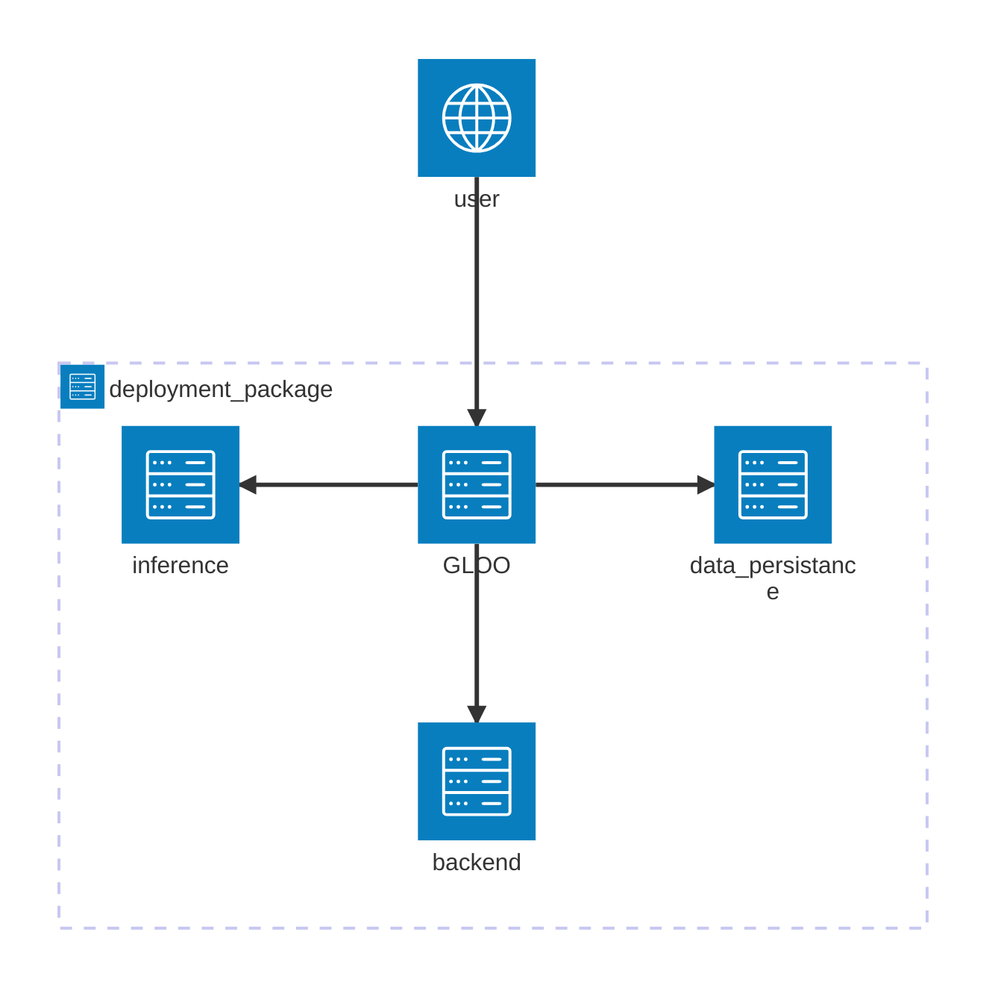

# ISIC Skin Cancer Classification

I submittd this project to DataTalks MLOps-zoomcamp 2025 course. [Course Link](https://github.com/DataTalksClub/mlops-zoomcamp)  

In this project, I created an MLOps system to classify skin cancer images from the Kaggle ISIC skin cancer dataset. [Dataset link](https://www.kaggle.com/competitions/isic-2024-challenge)

## Problem Description

**Skin cancer** can be deadly if not caught early. To prevent late diagnosis, machine learning models are developed to detect possible skin cancer with low cost.  

In this problem, data samples are composed of skin images and additional categorical and  numerical features. The goal is classify malignant skin lesions from benign ones.  

## Project Overview

In this project, we developed an MLOps system to automate the following tasks:  
- model training and validation
- experiment tracking
- workflows orchestration
- models deployment
- model monitoring

## Technology Stack

### Machine Learning

| Component                  | Technology                    |
|----------------------------|-------------------------------|
| Programming Language       | Python 3.12                   |
| Machine Learning Framework | PyTorch + PyTorch-Lightning   |
| Inference Framework | TensorRT   |
| Data Preprocessing         | AlbumentationsX + Torchvision |

### MLOps

| Component                                  | Technology |
|--------------------------------------------|------------|
| Workflow Orchestration                     | Airflow    |
| Experiment Tracking and Model Registry     | MLFlow     |
| Containerization                           | Docker     |
| Deployment Packaging and Software Management | Helm       |
| Container Orchestration                    | Kubernetes |

-  All components have been deployed to a single-node **Kubernetes** cluster. We used [**microk8s**](https://microk8s.io/) as a kubernetes orchestrator

- All software are managed (installation/upgrade/uninstallation) through [**Helm**](https://helm.sh/).

- **We do not package code in docker images. We only install python packages. The actual code (training, inference webservice, monitoring) is always retrieved from github before execution using a kuberenetes [init container](https://kubernetes.io/docs/concepts/workloads/pods/init-containers/) running `git clone`. This provides a lot of benefits including flexibility and simplified deployment.**

### Model Training

- The model training pipeline is handled through Airflow as a dag.

- The different stages:
  1. Allocate Kubernetes resources
  1. Download data
  2. Initialize MLFlow run
  3. Preprocess data
  4. Perform actual training
  5. Cleanup Kubernetes resources

- The  training and preprocessing code files are all logged to MLFlow for reproducibility. We also fixed initial randomness seeds to emphasize on the same goal.

- The dataset presented a couple of challenges:
  - The test set is negligible (3 samples) and without labels. We decided to split the original training set into a new training set and a new test set (80%-20%). The new test set is used to simulate monitoring.
  - The number of positive samples (skin cancer lesions) is too low compared to the total number of samples (400 positive samples from ~~ 400000 samples). To create the new test set, we used a stratified split (20% of the positive samples are in the new test set). Moreover, in the training, we used a stratified k-fold cross validation (to assess the model performance) followed by training on the whole training set. Unless we obtain more positive samples (or possibly generate new ones using generative AI), we can not further split the training data into training and validation.

### Model Deployment

-  The deployment package is managed using Helm. 

- We used a combination of streaming and webservice architectures.  

- The deployment package is composed of 3 components:
    1. **backend**: receives new data samples
    2. **data-persistance**: persists new data samples to database and file storage
    3. **inference**: performs  inference and saves probability scores to databasse

- To upload new data samples, we used the following **KAFKA-based** streaming architecture:   


- To query for uploaded data or inference  scores, we used a webservice architecture.  

To route http requests to the different components, we used [Gloo](https://www.solo.io/products/gloo-gateway) as an API gateway.



Depending on the request URL:  
  - localhost:port/v1/backend => backend component
  - localhost:port/v1/data-persistance => data persistance component
  - localhost:port/v1/inference => inference component

###  Monitoring

- Monitoring is performed as an  airflow dag. It can be scheduled to run on a daily basis. (To Do)

-  Monitoring can be done for a single date or a date range. (configuration through the Airflow UI)

- The Monitoring data is saved to a database. We used evidently to partially compute the metrics.

- A Grafana dashboard is used to display the results in a more intuitive way.

- True skin cancer cases with inference score < 0.5 are registered as alarms and displayed in the dashboard. (Missing true cancer cases is disastrous. It is more important to find all cancer cases than to flag a non-cancerous case)

### Code Quality

We used:
  - black for code formatting
  - isort for  import sorting
  - pylint for code linting
  - makefile to automate the different task
  - pre-commit hooks
  - one integration test
  - unit tests using pytest (only one test is added currently)

## Setup & Running

Prerequisites:
  - ubuntu 24.04 LTS (software tested only Ubuntu)
  - Python: 3.12
  - Git
  - Docker

### 1. Clone Repository

```shell
git clone https://github.com/Mahdi-Moalla/isic-skin-cancer-classification
```

### 2. Install Nvidia Container Toolkit

Please refer to this [link](https://docs.nvidia.com/datacenter/cloud-native/container-toolkit/latest/install-guide.html) to install Nvidia container toolkit. Please configure it just for [docker](https://docs.nvidia.com/datacenter/cloud-native/container-toolkit/latest/install-guide.html#configuring-docker) and [containerd](https://docs.nvidia.com/datacenter/cloud-native/container-toolkit/latest/install-guide.html#configuring-containerd-for-kubernetes)

### 3. Install Microk8s

for Ubuntu-based systems, you can use make to install microk8s
```shell
make init-microk8s
```
For other systems, please refer  to this [link](https://microk8s.io/tutorials)

### 4. Install Kubectl

Kubectl is a standard utility to interact with a kubernetes cluster. To  install it,  please refer to the following [link](https://kubernetes.io/docs/tasks/tools/#kubectl)

In order for Kubectl (or any tool interacting with kubernetes) to effectively communicate with a kubernetes cluster, a config file must be created or updated.

```shell
# if you have an existing kubernetes cluster run the following
make kube_config=update init-kube-config
# otherwise
make kube_config=create init-kube-config
```

### 5. install Helm
Please refer to the following [link](https://helm.sh/docs/intro/install/)

### 6. Download and Split Data

As discussed previously, we had to split the original training data.

Please download the original training files from [kaggle](https://www.kaggle.com/competitions/isic-2024-challenge/data). You need just the `train-metadata.csv` and `train-image.hdf5` files. You can also download them from this [google drive  link](https://drive.google.com/file/d/1insFKb58cCCabzPkLzSQZafSjZvN7Smd/view?usp=sharing).

After putting them in the `utils/project_data_prepare` path, run the following commands:

```shell
# ensure you have the necessary python packages
pip install fire tqdm h5py numpy pandas scikit-learn
cd utils/project_data_prepare
python split_data.py
cd ../..
```

### 7. Install k9s (optional)

This is a very handy terminal-based utility to inspect a kubernetes cluster.
You can find installation instructions on this [link](https://k9scli.io/topics/install/)

### 8. Init the MLOps  system

```shell
make build_images=true init-all
```

This will install the various services on the kubernetes cluster:  

- `Airflow`:
  - available on `localhost:8888`
  - Credentials:
    - name: `admin`
    - password: `admin`
- `MLFlow`
  - available on `localhost:5000` 
- `KAFKA`
- `Gloo` gateway
- `Adminer`
  - used to inspect the central postgresql database
  - Available on `localhost:8880`
  - database server: 
    - name: `airflow-service-postgresql`
    - port: `5432`
  - user: `postgres`
  - password: `postgres` 
- `kafka-ui`:
  - used to inspect the kafka service
  - Available on `localhost:8088`
  - kafka broker server:
    - name: `kafka-service-broker`
    - port: `9092`

In addition, this make target will perform a couple of additional  tasks:
  - create a simple python `http.server` that is used to download training data into the kubernetes cluster.
  - Initialize a couple of databases for `MLFlow`, `inference webservice` and the `monitoring` components. All  those databases can be inspected through `adminer`.


### 9. Train Model

To set the training configuration, you can modify the file `kubernetes_files/training_pipeline_config.yaml`. In this yaml file, you can find the definition of several json files. 

Then, apply it to the kubernetes cluster by executing this  command:

```shell
kubectl apply -f kubernetes_files/training_pipeline_config.yaml 
```

You can now login to Airflow. There will be a couple of dags.
You can start the `training_pipeline` dag and let it run to  completion.

The training pipeline does not automatically register the best model into MLFlow model registry. We opted for a manual process. The user can inspect the model performance and decide whether to register the model or no.

### 10. Start The inference Webserver

First, we need to register the model. We also need to retrieve the MLFLow run id.

In  MLFlow, this the structure of a run:


Click on the the parent run and retrieve the run id.


Also, you can register the best model to the registry. After selecting the model, click on register the model. The model name is already added to the registry. 


Now, we can start the inference webserver.

```shell
# make run_id=<run id> registry_model_version=<new model version> init-inference-webserver
make run_id=a744adc3f4d84c0796a5a8976ba6feb1 registry_model_version=1 init-inference-webserver
# wait a couple of seconds
make expose-inference-webserver  
```

### 11. Run Inference

We have prepared a script to upload a set of samples to the inference webservice. The data upload time will correspond to the month of january 2025. Use the following command:

```shell
bash utils/web_client/run_web_client.sh
```

It will take some time to process the whole data. To follow the process until is finishes, please use the following commands:

```shell
kubectl attach $(kubectl get pod -n isic-skin-cancer-classification | grep isic-inference-deployment |  cut -d ' ' -f1)
```

### 12. Run the  Monitoring Airflow Dag

The monitoring dag will request a set of parameters when it is triggered:
  - run_type (dropdown list): whether you want to run the  monitoring workload for a single day or for a range of days
  - start_date: this will be the day if you chose a single-day workload. You can use the calendar to choose it.
  - end_date
  - run_id: The MLFlow parent run id (we got in step 10)

Please choose a range workload for the month of january 2025. You can as well follow the process through the following command:

```shell
kubectl attach $(kubectl get pod -n isic-skin-cancer-classification | grep monitoring-pod |  cut -d ' ' -f1)
```

### 13. Run Grafana Dashboard

You can use make to run it:

```shell
make init-grafana
# wait a couple of seconds
make expose-grafana
```

Grafana is available on `localhost:8008`. The login credentials are `admin:admin`.

### Clean up Everything

```shell
make delete-cluster
```
